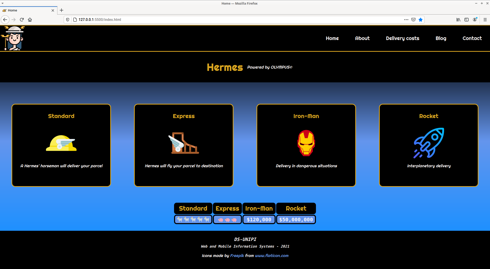

# My Courier Website
## DS-UNIPI
### Web and Mobile Information Systems - 2021

In this project is an implementation for a responsive website for an imaginary courier company.

The technologies used are the core web languages: HTML5, CSS3 and JavaScript.

The project's requirements are the implementation of five interfaces (pages).

---

For this project's responsiveness the viewport display width dimensions are classified like so:

-   **Desktop view** : width *greater than* **992px**.
-   **Tablet view**  : width *between* **992px** and **768px** (inclusive).
-   **Mobile view**  : width *less than* **768px**.

---

Every page of the web-app will have a navigation menu.
This menu will allow a user to navigate to any other page of the web-site he/she wants.

**Implementation**

The approach followed here is to include the navigation bar in the header element of each page.
The header will only be containing the company logo and the navigation menu bar.
The header and the footer will be included exactly the same in every page of the site.

Thus the header and footer were only written once like so:

```HTML
<header>

    </div>

    <nav>
        <ul id="nav-items-container">
            <li class="nav-item">
                <a class="nav-link" href="index.html">Home</a>
            </li>
            <li class="nav-item">
                <a class="nav-link" href="about.html">About</a>
            </li>
            <li class="nav-item">
                <a class="nav-link" href="delivery-costs.html">Delivery costs</a>
            </li>
            <li class="nav-item">
                <a class="nav-link" href="blog.html">Blog</a>
            </li>
            <li class="nav-item">
                <a class="nav-link" href="contact.html">Contact</a>
            </li>
        </ul>
    </nav>

    <button id="nav-button" onclick="toggleNav()">
        <div id="nav-button-top-bar"></div>
        <div id="nav-button-bottom-bar"></div>
    </button>

</header>
```

Since it is preferable to not just copy paste the above in every page,
The header can be just wrapped in a

```js
document.write( `<header> ... </header>` );
```

JavaScript statement and saved as `header.js` file.
And then included in every page with a `script:src` tag.

Same approach was followed for the footer (common in each page, included with script tags).

To clarify, below is the template for every page in this project

```HTML
<!DOCTYPE html>

<html lang="en">

    <head>

        <meta charset="UTF-8">
        <meta http-equiv="X-UA-Compatible" content="IE=edge">
        <meta name="viewport" content="width=device-width, initial-scale=1.0">
        <title>Page Title</title>

        <link rel="icon" href="sources/images/global/favicon.png">

        <link rel="stylesheet" href="css/styles.css">
        <script src="js/global/navbar.js" defer></script>

        <style>
            /*Main Page Content Styles */
        </style>

    </head>

    <body>

        <script src="js/global/header.js"></script>

        <main>
            <!-- Main Page Content Structure -->
        </main>

        <script src="js/global/footer.js"></script>

    </body>

</html>

```

To showcase the way the navigation bar works the screenshots below are included in this report:

The header and navigation bar is responsive.

-   In desktop view the navigation bar is displayed right on top of the header area.


-   In tablet and mobile view the navigation bar would take up too much space. Thus
    the navigation bar is hidden and a button is displayed instead.
    
    
    
    When the button is clicked the navigation bar element is "dropped".
    To hide the navigation bar again the button can be clicked again.

    

The responsiveness is achieved with the use of percentage-wise sizing and media queries:

```css
/* mobile and tablet view */

@media (max-width: 992px) {
    /* ... 
    several mobile and tablet only style rules 
    ... */
}


/* desktop view */

@media (min-width: 993px) {
    /* ...
    several mobile and tablet only style rules 
    ... */
}
```

The implementation of the mobile navigation bar animation is implemented in the files:
-   header.js
-   navbar.js
-   styles.css

The navigation bar is in the nav element in the header html element of the header.js file.

```js
document.write(
    `
        <header>

            </div>

            <nav>
                ...
            </nav>

            <button id="nav-button" onclick="toggleNav()">
                <div id="nav-button-top-bar"></div>
                <div id="nav-button-bottom-bar"></div>
            </button>

        </header>
    `
);
```

The **styles.css** contains media queries for desktop and tablet-mobile views.
In the tablet-moblie view the css rule for the nav element has animation attributes.
The animation-name is set to none by default.

```css

/* tablet and mobile view */

@media (max-width: 992px) {

    /* ... style rules for other elements ... */

    nav {

        /* ... position, background, size and color styles ... */
        
        animation-name: none; /* assigned in script.js */
        animation-duration: 1s;
        animation-fill-mode: forwards;
    }

    /* animation keyframes for nav */

    @keyframes nav-drop {
        0% { bottom: 100%; }

        100% { bottom: 0; } /* drop nav */
    }

    @keyframes nav-hide {
        0% { bottom: 0; }

        100% { bottom: 100%; } /* hide nav */
    }

    /* ... style rules for other elements ... */

}
```

The ***button element** in the header* has an onclick event which will call the **navbar.js** function.
This function will assign an animation-name to the nav element's style.

*   if the navigation bar is hidden t will assign the nav-drop animation keyframes.
*   Otherwise it will assign the nav-hide animation keyframes.

```js

/* ... setup ... */

function toggleNav() {

    /* ... DOM objects selection ... */

    if (navIsHidden) {

        nav.style.animationName = "nav-drop";

        /* ... some button style animation settings ... */

        navIsHidden = false;

    } else {

        nav.style.animationName = "nav-hide";

        /* ... some button style animation settings ... */

        navIsHidden = true;
    }
}

```

---

#### Interface 1:

***Initial (Home) Page***. Which will contain the sections below:

##### Descrption:

-   Who we are? ( text and image )

    -   2-grid column display in desktop view and
    -   1-grid column display in tablet and mobile view.

-   Our services ( services categories with the use of images )

    -   4-grid column in desktop view and
    -   2-grid column in tablet and mobile view

-   Price table ( `HTML5 table` )

##### Implementation:

Starting up from a template file like shown in the starting section of this report,
the only part of the html document to edit is the main element.

In the main element there are three sections
corresponding to the sections in the description.

The display of the container for the sections (main) is set to grid.
which by default will create a row for each one and place them in their respective row.

```HTMl
<!DOCTYPE html>
<html lang="en">
    <head>
        <!-- Common head content ... -->
        <title>Home</title>
        <style>
            main {
                display: grid;
                /* ... color styles ... */
            }
            /* ... Other styles ... */
        </style>
    </head>

    <body>
        <script src="js/global/header.js"></script>

        <main>
            <section id="main-header"> ... </section>    
            <section id="services-container"> ... </section>
            <section id="pricing-container"> ... </section>
        </main>

        <script src="js/global/footer.js"></script>
    </body>
</html>
```

The main-header section will have a heading with the name of the company
and some paragraph text.

The css for the main-header will have a display of grid.
This will align the items of the main-header in 2 rows one for each element within.
in mobile an tablet view the grid is kept this way. In desktop view the grid is modified
by setting the grid-template-columns to 1fr 1fr.

```HTML
<!DOCTYPE html>

<html lang="en">
    <head>
        <style>
            /* ... Other styles ... */
             #main-header {
                display: grid;
            }

            /* mobile and tablet view */
            @media (max-width: 992px) {
                /* main-header section styles */
                #main-header {
                    height: 4rem;
                    justify-items: center;
                    align-items: end;
                }
                /* ... Other styles ... */
            }

            /* desktop view */
            @media (min-width: 993px) {
                /* main-header section styles */
                #main-header {
                    height: 7.5rem;
                    grid-template-columns: 1fr 1fr;
                    align-items: center;
                }
                /* ... Other styles ... */
            }
            /* ... Other styles ... */
        </style>
    </head>
    <body>
        <script src="js/global/header.js"></script>
        <main>
            <section id="main-header">
                <h1>Hermes</h1>
                <p>Powered by OLYMPUS&copy;</p>
            </section>
            
            <section id="services-container"> ... </section>

            <section id="pricing-container"> ... </section>
        </main>
        <script src="js/global/footer.js"></script>
    </body>
</html>
```

In the services section resign four div elements with the class service
each one contains a heading an image and a small descriptive paragraph.

The layout of this section is using grid to have a 4-column grid in desktop view and
2-column in tablet and mobile view.

The section for the price table contains an HTML5 table.

```HTML
<!DOCTYPE html>

<html lang="en">
    <head>
        <style>
            /* ... Other styles ... */

            /* services section styles */

            #services-container {
                height: 100%;
                width: 100%;

                display: grid;
                grid-template-columns: 1fr 1fr;
                justify-items: center;
                align-items: center;
            }

            /* mobile and tablet view */

            @media (max-width: 992px) {
                /* services section styles */
                #services-container {
                    grid-template-columns: repeat(2, 1fr);
                }
            }

            /* desktop view */

            @media (min-width: 993px) {
                /* services section styles */
                #services-container {
                    grid-template-columns: repeat(4, 1fr);
                }
            }
        </style>
    </head>
    <body>
        <script src="js/global/header.js"></script>
        <main>
            <section id="main-header"> ... </section>
            
            <section id="services-container">
                <div class="service">
                    <h4> ... </h4>
                    
                    <p> ... </p>
                </div>
                <div class="service">
                    <h4> ... </h4>
                    
                    <p> ... </p>
                </div>
                <div class="service">
                    <h4> ... </h4>
                    
                    <p> ... </p>
                </div>
                <div class="service">
                    <h4> ... </h4>
                    
                    <p> ... </p>
                </div>
            </section>

            <section id="pricing-container">
                <table id="pricing"> ... </table>
            </section>
        </main>
        <script src="js/global/footer.js"></script>
    </body>
</html>
```

##### Results:

***Desktop view***



***Tablet view***


***Mobile view***


---

#### Interface 2:

***Our Company***

##### Descrption:

-   About us ( Use of HTML5 responsive `video` )

    - 2-grid column display in a desktop view and
    - 1-grid column display in tablet and mobile view

##### Implementation:

Again, starting from the page template the only inclusion is the content of the main element.
The main content has only to div element items.
*   The HTML5 video element
*   A descriptive paragraph

The responsiveness is implemented again with the use of the display attribute for the main style
setting it to grid and wuth the use of media queries. The media query for the:
*   mobile and tablet view for the main has a grid-template-columns property set to 1fr
*   desktop view for the main has a grid-template-columns set to 1fr 1fr 

```HTML
<!DOCTYPE html>

<html lang="en">

    <head>

        <meta charset="UTF-8">
        <meta http-equiv="X-UA-Compatible" content="IE=edge">
        <meta name="viewport" content="width=device-width, initial-scale=1.0">
        <title>Page Title</title>

        <link rel="icon" href="sources/images/global/favicon.png">

        <link rel="stylesheet" href="css/styles.css">
        <script src="js/global/navbar.js" defer></script>

        <style>
            /* Other Styles */

            main {
                display: grid;
                justify-items: center;
                align-items: center;

                /* other styles */
            }

            /* mobile and tablet view */
            @media (max-width: 992px) {
                main {
                    grid-template-columns: repeat(1, 1fr);
                }
            }

            /* desktop view */
            @media (min-width: 993px) {
                main {
                    grid-template-columns: repeat(2, 1fr);
                }
                /* other styles */
            }

            /* other styles */
        </style>

    </head>

    <body>

        <script src="js/global/header.js"></script>

        <main>
            <div id="video-container">
                <video controls autoplay muted loop>
                    <source src="sources/videos/about/about-video.mp4" type="video/mp4">
                </video>
            </div>

            <div id="description">
                <h1> ... </h1>
                <p> ... </p>
            </div>
        </main>

        <script src="js/global/footer.js"></script>

    </body>

</html>

```

##### Results

***Desktop view***


***Tablet view***


***Mobile view***


---

#### Interface 3:

***Delivery Costs Calculation Page*** (HTML5 delivery costs calculation `form`)

##### Descrption:

The cost of deliver for a parcel with:

-   a `weight` (in kg) and
-   a `postcode` ( 5-digit format )

will be calculated according to the formula: *`Delivery cost` = `Weight cost` + `Commission`*

| PC          | Weight_cost( <= 5kg ) | Weight_cost( > 5kg )                         | Commission |
|-------------|-----------------------|----------------------------------------------|------------|
| 10000-20000 | 0.5€ / kg             | 0.5€ / kg + 0.3€ for each kilogram over 5 kg | 0.5€       |
| 20001-30000 | 0.5€ / kg             | 0.5€ / kg + 0.2€ for each kilogram over 5 kg | 1€         |
| 30001-40000 | 1€ / kg               | 1€ / kg + 0.25€ for each kilogram over 5 kg  | 1.5€       |
| 40001-50000 | 1.5€ / kg             | 1.5€ / kg + 0.2€ for each kilogram over 5 kg | 2€         |
| 50000-99999 | 2€ / kg               | 2€ / kg + 0.15€ for each kilogram over 5 k1g | 2.5€       |

The form must also implement validation rules for the inputs,
ensuring the weight and postcode are in proper format.

*   The **postcode** is set as:
    ```HTML
    <input type="number" name="postcode" id="postcode" min="10000" max="99999" required>
    ```
    In this way the user has to input a number.
    Any non-numeric input will not allow the user to submit the form.
    The number cannot be less than 10000.
    The number cannot be more than 99999.
    Thus the only valid input that will allow the user to submit the form is
    a numeric value in the range of [ 10000 - 99999 ]

    The postcode is required. So if the field is empty the user cannot submit the form.

*   The **weight** is set as:

    ```HTML
    <input type="number" name="weight" id="weight" step="0.001" required>
    ```

    In this way the user has to input a number. The step is set to 0.001
    thus the weight can be accureate upt to 3 decimal points.

    The weight field is also required.
    The user has to ender a valid weight value or he/she cannot submit the form.

Following, there is the submit input - a button so that the user can submit the form.

And lastly, there is the output div element which will be updated by the delivery-costs.js file
which implements the logic for calculating the delivery costs by the postcode and the weight.

The delivery-costs.js file is imported in the delivery-costs.html file with a script:src tag.

##### Implementation:

```HTML
<!DOCTYPE html>

<html lang="en">

    <head>
        <!-- ... other head contents ... -->
        <title>Delivery Costs</title>
        <script src="js/delivery-costs/delivery-costs.js" defer></script>
    </head>

    <body>

        <script src="js/global/header.js"></script>

        <main>

            <form>

                <div class="input-container">
                    <label for="postcode">Postcode</label>
                    <input type="number" name="postcode" id="postcode" min="10000" max="99999" required>
                </div>

                <div class="input-container">
                    <label for="postcode">Weight (in kg)</label>
                    <input type="number" name="weight" id="weight" step="0.001" required>
                </div>

                <div id="submit-container" class="input-container">
                    <input id="submit" type="submit" value="Show My Delivery Costs">
                </div>

            </form>

            <div id="output-container"></div>

        </main>

        <script src="js/global/footer.js"></script>

    </body>

</html>

```

In the delivery-costs.js file the calculation of the delivery costs is implemented.

Firstly, the form is retreived from the DOM in a variable called form.
Then, an eventListener is added to the form, listening for the submit event.
an anonymous funciton is the second parameter of the listener which does the calculation
on the event of submition.

```js
// get the delivery-costs form from the DOM
const form = document.querySelector("form");

form.addEventListener("submit", function(event) { /* logic */ });
```

The following logic is present the handler function ( `function(event) { /* logic */ }` )

The first thing the handler function does is to prevent the submit redirection with the command
```js
    event.preventDefault();
```
so that the user will stay on the page to see the output of this calculation.

Afterwards the handler:

1.  gets the postcode input value from the DOM and converts it to an integer.
```js
    const postcodeStr = document.querySelector("#postcode").value;
    const postcode = parseInt(postcodeStr); // convert to integer
```

2.  gets the weight input value from the DOM and converts it to a float.
```js
    const weightStr = document.querySelector("#weight").value;
    const weight = parseFloat(weightStr); // convert to float
```

( there is no need for any further validation since itis handled by the input elements in the html )

3.  Then the handler defines the key variables for the calculation:

```js
    let weightRate; // the rate for weight <= 5kg
    let overweight; // the rate for over 5kg kilograms
    let commission; // the commission amount
```

4.  Assign variables appropriately ( based on the range the postcode is in - according to the table)

```js
    if (postcode <= 20000) {
        weightRate = 0.50;
        overweight = 0.30;
        commission = 0.50;
    } else if (postcode <= 30000) {
        weightRate = 0.50;
        overweight = 0.20;
        commission = 1.00;
    } else if (postcode <= 40000) {
        weightRate = 1.00;
        overweight = 0.25;
        commission = 1.50;
    } else if (postcode <= 50000) {
        weightRate = 1.50;
        overweight = 0.20;
        commission = 2.00;
    } else {
        weightRate = 2.00;
        overweight = 0.15;
        commission = 2.50;
    }
```

5.  calculate the cost corresponding to the parcel weight.
    Examine if the weight is over 5kg and act according to the table.
    
```js
    let weightCost;

    if (weight <= 5.000) {
        weightCost = weight * weightRate;
    } else {
        weightCost = 5.000 * weightRate + (weight - 5.000) * overweight;
    }

    let totalCost = weightCost + commission;
```

6.  Contruct and output the result to the document (DOM element with id output-container).
    Also alert the user about the result.

```js
    const output = document.querySelector("#output-container");

    output.innerHTML =
        `
            <p id="output">
                The costs for your delivery are
                <span id="cost">${totalCost.toFixed(2)}&euro;</span>
            </p>
        `;
    // set up the styles for the output
    const outputContainer = document.querySelector("#output-container");
    outputContainer.style.width = "85%";
    outputContainer.style.padding = "2.5%";

    alert(`The costs for your delivery are ${totalCost.toFixed(2)}€`);
```
---

##### Results

***Initial view***


***Output***


#### Interface 4:

***Blog Page*** (Presentation of four articles with images)

##### Descrption:

-   4-grid column display in desktop view and
-   2-grid column display in mobile view.

##### Implementation:

Starting from the template for every page in this project,
the main element will contain four article elements.

Each article element has an id of the form article-[1|2|3|4] and will contain:
*   a button to expand and collapse the article of the class article-btn
*   an image relating to the topic of the article
*   a heading-2 with the title of the article
*   a paragraph with the text content of the article


```HTML
<!DOCTYPE html>
<html lang="en">
    <head>
        <!-- Common head contents -->
        <title>Blog</title>
        <style>
            /*Main Page Content Styles */
        </style>
    </head>

    <body>

        <script src="js/global/header.js"></script>

        <main>
            <article id="article-1">
                <button class="article-btn">expand</button>
                
                <h2 class="article-title"> ... </h2>
                <p class="article-content" id="article-content-1"> ... </p>

            </article>

            <article id="article-2">
                <button class="article-btn">expand</button>
                
                <h2 class="article-title"> ... </h2>
                <p class="article-content" id="article-content-2"> ... </p>

            </article>

            <article id="article-3">
                <button class="article-btn">expand</button>
                
                <h2 class="article-title"> ... </h2>
                <p class="article-content" id="article-content-3"> ... </p>
            </article>

            <article id="article-4">
                <button class="article-btn">expand</button>
                
                <h2 class="article-title"> ... </h2>
                <p class="article-content" id="article-content-4"> ... </p>
            </article>
        </main>

        <script src="js/global/footer.js"></script>

    </body>
</html>

```

The responsive layout is achieved with the use of media queries:

*   In desktop view a grid-template-columns: 25% 25% 25% 25% is used.
    making the container of the main content have 4 equal columns in
    which it places the articles respectively. Which results in displaying
    the articles in equal size in the same row in equal distances from each other.

*   In tablet view a
    
    grid-template-columns: 50% 50% and a
    grid-template-rows: 50% 50% is used,

    making the container of the main content have 2 equal columns and 2 equal rows,
    so in essence four cells of equal proportions in which it places the articles 
    respectively. This results in displaying the first two articles in the first
    row and the next two in the second with equal distance from each other.

*   In mobile view a grid-template-rows: 25% 25% 25% 25% is used.
    making the container of the main content have 4 equal rows in
    which it places the articles respectively. Which results in displaying
    the articles in equal size in the same column in equal distances from each other.

```HTML
<!DOCTYPE html>
<html lang="en">
    <head>
        <!-- Common head contents -->
        <title>Blog</title>
        <style>
            /* mobile view */
            @media (max-width: 767px) {
                /* more css */
                main {
                    display: grid;
                    grid-template-rows: repeat(4, 25%);
                    justify-items: center;
                    align-items: center;
                    /* more css */
                }
                /* more css */
            }

            /* tablet view */
            @media (max-width: 992px) and (min-width: 768px) {
                /* more css */
                main {
                    display: grid;
                    grid-template-rows: repeat(2, 50%);
                    grid-template-columns: repeat(2, 50%);
                    justify-items: center;
                    align-items: center;
                    /* more css */
                }
                /* more css */
            }

            /* desktop view */
            @media (min-width: 993px) {
                /* more css */
                main {
                    display: grid;
                    grid-template-columns: repeat(4, 25%);
                    grid-template-rows: repeat(1, 100%);

                    justify-items: center;
                    align-items: center;
                }
                /* more css */
            }
        </style>
    </head>

    <body>

        <script src="js/global/header.js"></script>

        <main>
            <article id="article-1"> ... </article>
            <article id="article-2"> ... </article>
            <article id="article-3"> ... </article>
            <article id="article-4"> ... </article>
        </main>

        <script src="js/global/footer.js"></script>

    </body>
</html>

```

It was desired to be able to fit all articles in the screen without the need for scroll.
But the combined text-content of all four articles in the general case won't be able to
fit in the screen without scrolling especially in the tablet and mobile view.

So the idea is to only display the heading and the image fully in tablet and mobile view.
While letting the user see only the start of the text-content in each article.
If the user is interested in reading an article there will be a button.
Clicking the button will expand the article to fill the whole page and displaying the full content.

Clicking the same button will collapse the article back to its original size and position.

This is implemented with animations defined in the style tags of the blog.html file
and some JavaScript functionality defined in the blog.js file.

In mobile view:

we define the class focus which contains the css rules for the animation of an article. 
When the button labeled "expand" is clicked this class will be assigned to the button's parent article element.

Since the animation needed to be performed is dependant on the state of the article
(expanded/collapsed) the animation-name is set to none and assigned accordingly by
the JavaScript in the blog.js file.

```css
.focus {
    animation-name: none;
    animation-duration: 1s;
    animation-fill-mode: forwards;

    z-index: 1;
}
```

There are two animations that are associated with the expand and collapse functionality.
The expand animation will almost quadruple the height of the article making it expand
to the entirety of the main content's space

and places the quadrupled to the center of the page ,
translating its position in the y-axis by the appropriate transform value,
which is assigned in the JavaScript of the blog.js file.

The same logic applies for the tablet view but in two dimensions.
So the he expand animation will almost double the height and width of the article
making it expand to the entirety of the main content's space

and places the quadrupled to the center of the page ,
translating its position in the y-axis by the appropriate transform value,
which is assigned in the JavaScript of the blog.js file.


The destop view doesn't have any animations and the user can scroll through the article content.

Below is the relative to the basics of mobile view article animations.
(The tablet view has a similar logic but to save space in this already long report
let's not show it. Everybody is welcome to check out the blog.html style tag for tablet view)

```css
/* mobile view */

@media (max-width: 767px) {

    :root {
        --translateY-value: 0; 
    }

    @keyframes expand {
        0% {
            width: 90%;
            height: 80%;
        }

        100% {
            /* color styles */
            transform: translateY(var(--translateY-value));

            height: 385%;
            width: 95%;
        }
    }

    /* more css ... */

```

The collapse will revert the article to its original size and position.

```css

    @keyframes collapse {
        0% {
            /* color styles */
            transform: translateY(var(--translateY-value));
            height: 385%;

            width: 95%;
        }

        100% {
            width: 90%;
            height: 80%;
        }
    }

    /* more css */

}
```

So the action chain is as follows.

1.  The user clicks the "expand" button of the article he/she wants to read
    triggering a click event.

2.  An event listener on the button will capture the click and
    its handler will assign the animation name of the focus class to "expand".
    This will associate the focus class with the expand animation.

3.  The handler will assign the class focus to the parent article of the button and
    the animation will execute.

The logic above is implemented in the blog.js file.

The first thing that the handler needs is a flag that keeps track of whether an article
is expanded or not. So a variable is defined called isExpanded:

```js
var isExpanded = false;
```

Since every button can be clicked, in the beginning of the file there is a forEach statement
assigning an eventListener to each element of class articleBtn as well as the same handler.

```js
document.querySelectorAll(".article-btn").forEach(button => {
    button.addEventListener( "click", event => { /* handler logic */ } );
});

```

The handler's logic can be described abstractly as follows:

1.  get the parent article of the button.

    ```js
    const article = button.parentElement;
    ```
2.  get the article id's ending (unique) number. (Required for step 6)
    ```js
    const articleNumber = article.id[article.id.length - 1];
    ```
3.  get the device screen width ( the animations for the mobile and tablet views are different )
    ```js
    const width = (window.innerWidth > 0) ? window.innerWidth : screen.width;
    ```

4.  determine the appropriate trasformation values:
    ```js
    switch (articleNumber) {
        case "1":
            translateYValue = (width < 768) ? "37.5%" : "25%";
            translateXValue = "25%";
            break;
        case "2":
            translateYValue = (width < 768) ? "12.5%" : "25%";
            translateXValue = "-25%";
            break;
        case "3":
            translateYValue = (width < 768) ? "-12.5%": "-25%";
            translateXValue = "25%";
            break;
        case "4":
            translateYValue = (width < 768) ? "-37.5%" : "-25%";
            translateXValue = "-25%";
            break;
        default: console.log("Something went wrong in the switch statement");
    }
    ```
    
5.  set the trasformation values in the blog.html styles in the :root
    ```js
    document.documentElement.style.setProperty("--translateY-value", translateYValue);
    document.documentElement.style.setProperty("--translateX-value", translateXValue);
    ```

6.  get the appropriate article content (i.e. the "in focus" article's paragraph)
    ```js    
    const articleContent = document.querySelector("#article-content-" + articleNumber);
    ```

7.  If the article is not expanded:
    *   Assign to the article the class focus (enabling the expand animation).
    *   Assign to the article the expand animation (actuating the expand animation).
    *   Set white-space to normal in the article content.
    *   Change the inner HTML of the button to "collapse".
    *   Change isExpanded flag to true.
    *   Allow scrolling for the article content after the animation completes (1 second).

    Otherwise, if the article is already expanded:
    *   Assign to the article the collapse animation.
    *   Set article contetn's whitespace to nowrap.
    *   Hide article contetn's overflow.
    *   Change button's inner HTML to "expand".
    *   Change isExpanded flag to false.
    *   Change the artcile class name to a dummy class "pocus" 
        so that focus class doesn't apply to it anymore
        after the animation completes (1 second).
```js
    if (isExpanded) {

        article.style.animationName = "collapse";
        articleContent.style.whiteSpace = "nowrap";
        articleContent.style.overflow = "hidden";
        button.innerHTML = "expand";

        isExpanded = false;

        setTimeout(() => {
            article.className = "pocus";
        }, 1000);

    } else {
        
        article.className = "focus";

        article.style.animationName = "expand";
        articleContent.style.whiteSpace = "normal";
        button.innerHTML = "collapse";

        isExpanded = true;

        setTimeout(() => {
            articleContent.style.overflow = "scroll";
        }, 1000);
    }
```
##### Results

***Desktop view***


***Tablet view***


***Tablet view (expand)***


***Mobile view***


***Mobile view (expand)***


---

#### Interface 5:

***Contact Page***

##### Descrption:

-   Contact `form` (Inputs: Name, Email, Topic and Message)
-   Contact Information ( Address, Phone-Number [ linkable ], Email [ linkable ] )
-   Goole Map with the use of `iframe` element

If the user attempts to click `submit` while any of the inputs are not filled,
a corresponding `alert` message must be displayed to the user to inform him/her.

##### Implementation:

Starting from the template for every page in this project,
the main element will contain a contact-form, contact information and a google-map iframe.

```HTML
<!DOCTYPE html>
<html lang="en">
    <head>
        <!-- Common head content -->
        <title>Contact</title>
        <style> /*...*/</style>

        <script src="js/contact/contact.js" defer></script>
    </head>

    <body>

        <script src="js/global/header.js"></script>

        <main>
            <form> ... </form>

            <div id="contact-info-container"> ... </div>

            <iframe> ... </iframe>
        </main>

        <script src="js/global/footer.js"></script>
        
    </body>
</html>
```

To validate that the user has entered every required input WITH JavaScript
(but not with the HTML input attributes) The following script
```js
document.getElementById("submit").addEventListener("click", event => {

    const name = document.getElementById("name").value;
    const email = document.getElementById("email").value;
    const topic = document.getElementById("topic").value;
    const message = document.getElementById("message").value;

    const emptyInputs = [];

    if (name.length === 0) {
        emptyInputs.push ("name");
    }
    
    if (email.length === 0) {
        emptyInputs.push ("email");
    }
    
    if (topic.length === 0) {
        emptyInputs.push ("topic");
    }
    
    if (message.length === 0) {
        emptyInputs.push ("message");
    }

    if (emptyInputs.length === 0) {
        return;
    }

    let alertMessage = "The fields ";

    for (let input of emptyInputs) {

        alertMessage += (input + ", ");
    }

    alert(alertMessage + "are not filled");
});
```
Adds an event listener to the submit input button with the handler doing the below:
1.  Gets all the input elements from the DOM.
2.  Initializes an empty array called emptyInputs.
3.  For each of the input values it checks if they are empty
4.  If an input value is empty, the input name is pushed to the array.
5.  If the array is empty it returns with no alerts.
6.  If the array is not empty it will alert the user about the inputs that aren't filled.

##### Results

***Desktop view***


***Mobile view***


***Mobile view ( incomplete submit alert )***


---